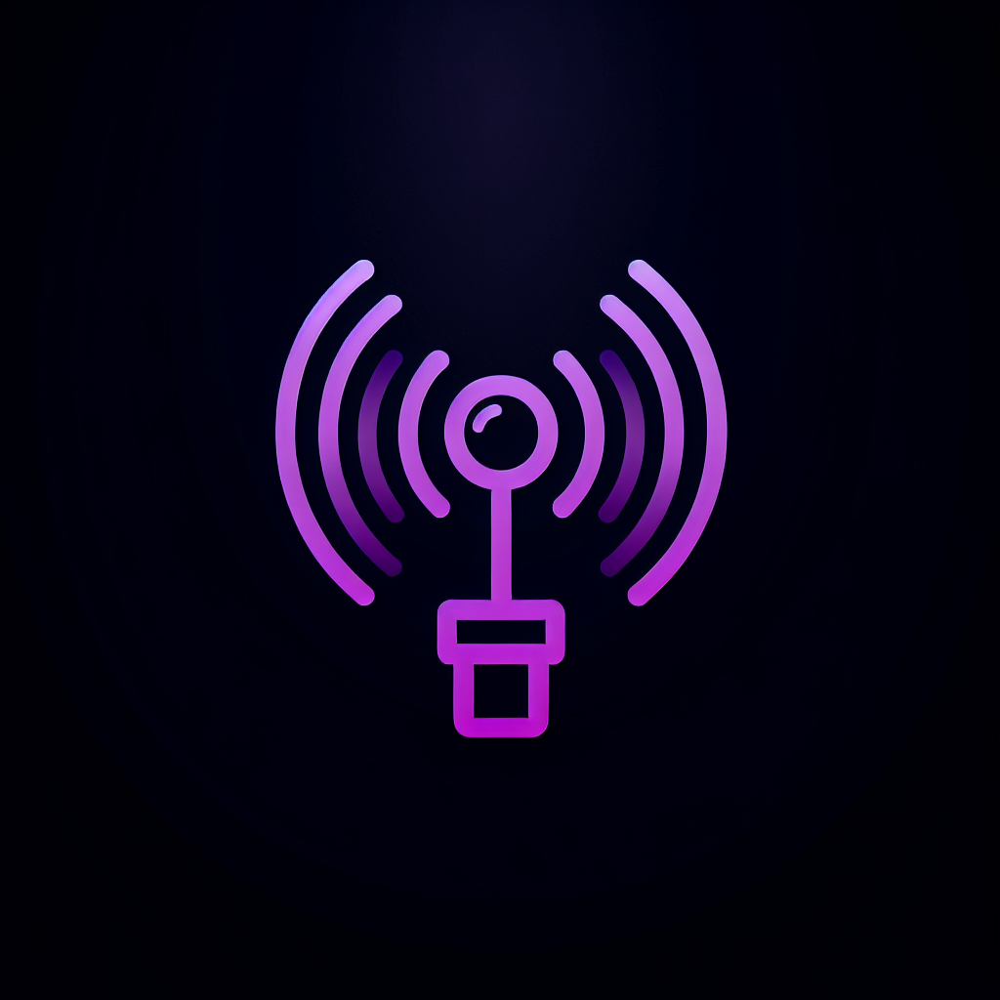

# NullHandshake



## Modern Wireless Network Security Assessment Framework

NullHandshake is a comprehensive, plugin-driven offensive security framework designed for wireless network post-exploitation and credential harvesting. With its sleek, futuristic web interface, NullHandshake provides security researchers with an intuitive tool for identifying vulnerable networks, extracting credentials, and executing advanced wireless attacks.

### Key Features

- **Fully Web-Based GUI**: Intuitive, modern interface with animated transitions and no CLI dependency
- **Modular Plugin Architecture**: Self-contained modules for specialized attack vectors
- **Cross-Platform Credential Harvesting**: Extract credentials from Windows, Linux, and macOS systems
- **Evil Twin Automation**: Simplified rogue access point creation and management
- **WPA Handshake Capture**: Automated discovery and capture for offline cracking
- **Real-Time Scanning**: Interactive wireless network scanning and monitoring
- **Interactive Command Console**: Built-in terminal for advanced operations
- **Visual Analytics**: Data visualization for discovered networks and devices

### Modules

- **WiFi Recon**: Discover and analyze wireless networks in range
- **Credential Harvester**: Extract and manage harvested login credentials 
- **Evil Twin**: Deploy and manage rogue access points for MITM attacks
- **WPA Handshake**: Capture authentication handshakes for offline cracking

### Screenshots

*[Add screenshots here]*

### Installation

```bash
# Clone the repository
git clone https://github.com/yourusername/nullhandshake.git
cd nullhandshake

# Install dependencies
pip install -r requirements.txt

# Run the web interface
python main.py
```

### Usage

Access the web interface at http://localhost:5000 after starting the application.

For CLI usage:
```bash
python nullhandshake.py
```

### ⚠️ Legal Disclaimer

NullHandshake is intended for legal security research and penetration testing only. Users are responsible for complying with applicable laws. The developers assume no liability for misuse or damage caused by this software.

### Contributing

Contributions are welcome! Please feel free to submit a Pull Request.

### License

This project is licensed under the MIT License - see the LICENSE file for details.